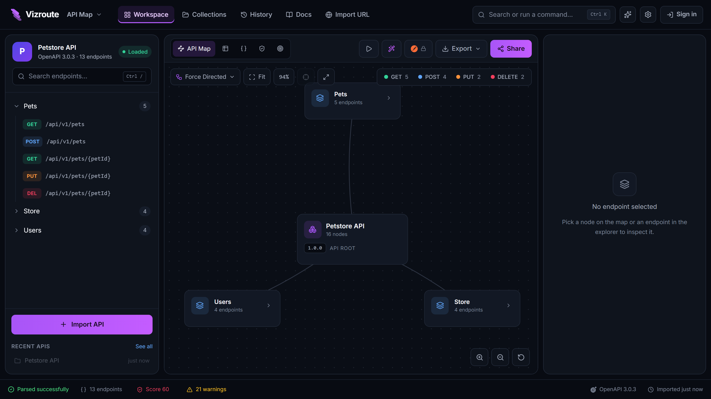
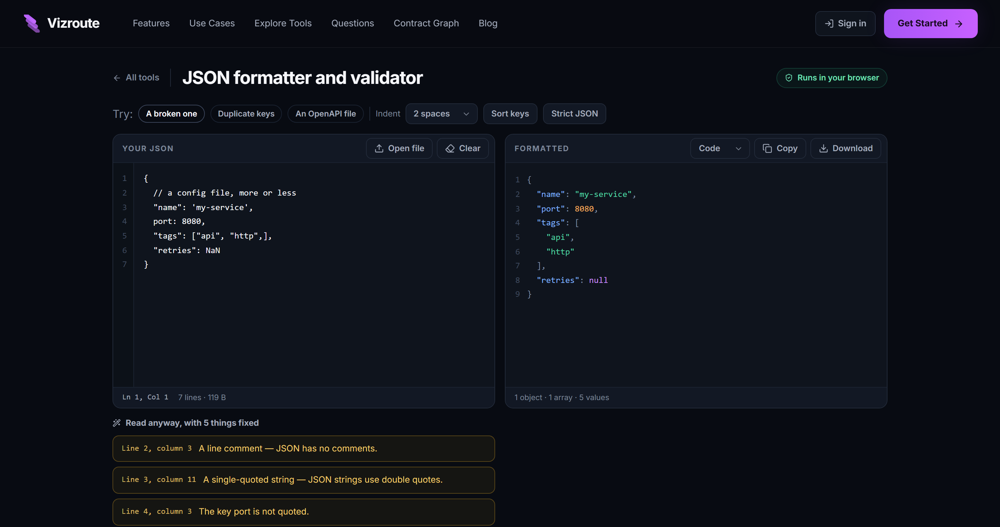

# Vizroute

**Turn any API specification into a map you can read, send requests from, audit and diff — in your browser.**

Drop in an OpenAPI, Swagger, Postman, cURL, HAR or WSDL file and get the shape
of the API drawn out: the services, the resources, the operations underneath
them. Then send a real request against it, check what the specification gets
wrong, compare it to last week's version, and hand it on as docs, an image or
a link.

Nothing is uploaded. Every specification is parsed by JavaScript in the tab
you are looking at — there is no backend to send it to.



---

## What is in it

| Area | Route | What it is for |
| --- | --- | --- |
| **API Map** | `/workspace` | One specification: map, table, raw source, endpoint inspector, playground, environments, mock data, load and health checks, audit, coverage, diff, breaking changes, docs, export, share links and embeds. No account. |
| **Contract Graph** | `/graph` | Many services on one map: entities more than one service exposes, duplicate endpoints, one concept under several names, and which services depend on which. Needs an account, because an estate has to belong to someone. |
| **Explore Tools** | `/tools` | Standalone pages for the things you need once an hour — a JSON formatter, a diff, a JSONPath tester, a size profiler, an NDJSON viewer. Paste something, get an answer, keep your data. |
| **Blog** | `/blog` | Written in Markdown, prerendered to static HTML at build time. |

It reads OpenAPI 2.0, 3.0 and 3.1, Swagger, Postman collections v1 and v2,
cURL commands, HAR recordings, plain JSON or YAML endpoint lists, a remote URL
it fetches for you, and WSDL.



---

## Running it

```bash
git clone https://github.com/SagarKapase/snap-map.git
cd snap-map
npm install
npm run dev
```

That is the whole setup. Everything works with no configuration: accounts fall
back to this browser, and no key is needed to open a specification.

### Scripts

| Command | What it does |
| --- | --- |
| `npm run dev` | Vite dev server |
| `npm run build` | Production build, then the prerender step |
| `npm run preview` | Serve the built output |
| `npm run lint` | ESLint over the repository |
| `npm test` | Vitest, once |
| `npm run test:watch` | Vitest, watching |
| **`npm run verify`** | **lint + tests + build. Run this before saying anything is finished.** |
| `npm run seo` | The prerender step on its own, against an existing build |
| `npm run bridge` | The SOAP bridge host (only with the SOAP workbench switched on) |

### Configuration

Copy `.env.example` to `.env.local`. Every variable is optional.

| Variable | Without it |
| --- | --- |
| `VITE_SUPABASE_URL`, `VITE_SUPABASE_ANON_KEY` | Accounts live in this browser only, and the page says so. Set both for real sign-up, and for Google and GitHub sign-in — see [docs/accounts.md](docs/accounts.md). |
| `VITE_SITE_URL` | Canonical links and the sitemap use the default domain. Set it before deploying. |
| `VITE_OPENROUTER_API_KEY`, `VITE_OPENROUTER_MODEL` | The optional AI assistant is off. It is the only part of the app that talks to anyone but the API you are testing. |
| `VITE_SOAP_WORKBENCH` | The SOAP Migration Workbench at `/soap` is off, and its code is not built. Set it to exactly `on` to bring it back — see [docs/soap-migration-workbench.md](docs/soap-migration-workbench.md). |

Vite inlines `VITE_*` variables into the bundle, so never put a secret in one.
The Supabase *anon* key is meant for browsers; the service-role key is not.

---

## How it is laid out

```
src/
  utils/              pure logic, all of it testable — parsers, diff, audit,
                      conversion, layout, the SOAP engine, the tool modules
  utils/tools/        one module per Explore Tool
  tools/              registry.js, and one folder per tool (meta.js is plain data)
  components/         UI, grouped: landing/ tools/ auth/ shell/ workspace/
                      contractgraph/ soap/ home/ import/ blog/ icons/ ai/
  pages/              one per route
  content/            blog posts, FAQ and landing copy
scripts/seo.mjs       prerenders /, /blog, /tools and each tool page;
                      writes sitemap.xml and robots.txt
server/               the SOAP bridge host
docs/                 the plan for each feature, written before it was built
```

Three rules hold the shape of it, and each exists because breaking it cost
something:

- **Logic lives in `src/utils/`, not in components.** It is the part that can
  be tested, and every feature here has needed that.
- **Anything `scripts/seo.mjs` imports must run under plain Node** — no JSX, no
  `import.meta.glob`, nothing from the bundler. That is why the tool registry
  is plain data and the icons travel as strings.
- **A page meant to be found is prerendered with its real copy.** The app
  renders in the browser, so without that step a crawler sees one empty
  `<div id="root">` for every address.

---

## Testing

```bash
npm test
```

384 tests, all of them over the pure logic in `src/utils/` — parsers, the
diff, the SOAP engine, the tool modules. Every parser is given hostile input
as a matter of course: empty, truncated, one character, deeply nested, a
byte-order mark, something that is not the format at all.

Two of them assert wall-clock performance budgets and can fail on a loaded
machine while passing in isolation. If `contractGraph > stays fast on a large
estate` or `soapWsdl > handles a 5 000-operation WSDL within a time budget`
fails, run it again before believing it.

There is no type checking: this is a JavaScript project.

---

## Deploying

```bash
VITE_SITE_URL=https://your-domain npm run build
```

`dist/` is a static site — no server required. The build writes a real HTML
file for `/`, `/tools`, every tool page, `/blog` and every post, so those
addresses work without an SPA rewrite rule. Anything deeper (`/workspace`,
`/graph`) is client-routed and needs the usual fallback to `index.html`.

---

## Documentation

Each feature was planned in writing before it was built, and the plans are
kept up to date as they are worked through:

- [docs/explore-tools.md](docs/explore-tools.md) — the 45 standalone tools, phase by phase
- [docs/contract-graph.md](docs/contract-graph.md) — mapping an estate of services
- [docs/soap-migration-workbench.md](docs/soap-migration-workbench.md) — WSDL to a working REST API
- [docs/accounts.md](docs/accounts.md) — accounts, and Google and GitHub sign-in
- [docs/blog.md](docs/blog.md) — how posts are written and prerendered
- [docs/brand.md](docs/brand.md) — the mark, the palette and the type

[CLAUDE.md](CLAUDE.md) holds the rules this repository is worked on under.

---

## Built with

React 19 · Vite 7 · React Router 7 · Tailwind 4 · Vitest 3 · lucide-react ·
js-yaml · lz-string

No UI framework, no state library, no icon dependency beyond lucide, and no
backend. The XML, WSDL, Markdown and JSON parsers are written here, because
each needed to report where something went wrong rather than only that it did.
